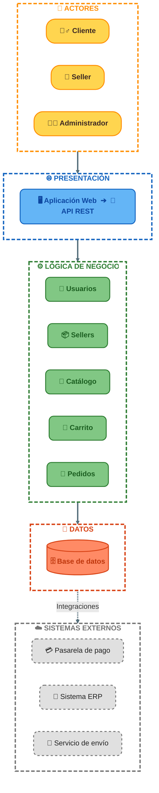

```mermaid
flowchart TD
    %% =========================
    %% ESTILOS GLOBALES (Diseño Moderno / Material)
    %% =========================
    classDef actor fill:#FFD54F,stroke:#FF8F00,stroke-width:2px,color:#3E2723,rx:20,ry:20,font-weight:bold
    classDef presentacion fill:#64B5F6,stroke:#1565C0,stroke-width:2px,color:#0D47A1,rx:10,ry:10,font-weight:bold
    classDef negocio fill:#81C784,stroke:#2E7D32,stroke-width:2px,color:#1B5E20,rx:10,ry:10,font-weight:bold
    classDef datos fill:#FF8A65,stroke:#D84315,stroke-width:2px,color:#BF360C,font-weight:bold
    classDef externo fill:#E0E0E0,stroke:#757575,stroke-width:2px,color:#212121,stroke-dasharray: 5 5,rx:10,ry:10

    %% Estilo global de las líneas conectoras
    linkStyle default stroke:#546E7A,stroke-width:3px,fill:none

    %% =========================
    %% ACTORES
    %% =========================
    subgraph ACTORES ["👥 ACTORES"]
        direction LR
        Cliente["🙎‍♂️ Cliente"]:::actor
        Seller["🏪 Seller"]:::actor
        Admin["👨‍💻 Administrador"]:::actor
    end

    %% =========================
    %% PRESENTACIÓN
    %% =========================
    subgraph PRESENTACION ["🌐 PRESENTACIÓN"]
        Web["🖥️ Aplicación Web  ➔  🔌 API REST"]:::presentacion
    end

    %% =========================
    %% LÓGICA DE NEGOCIO
    %% =========================
    subgraph NEGOCIO ["⚙️ LÓGICA DE NEGOCIO"]
        direction LR
        Usuarios["👤 Usuarios"]:::negocio
        Sellers["📦 Sellers"]:::negocio
        Catalogo["📑 Catálogo"]:::negocio
        Carrito["🛒 Carrito"]:::negocio
        Pedidos["🧾 Pedidos"]:::negocio
    end

    %% =========================
    %% DATOS
    %% =========================
    subgraph DATOS ["💾 DATOS"]
        BD[("🗄️ Base de datos")]:::datos
    end

    %% =========================
    %% SISTEMAS EXTERNOS
    %% =========================
    subgraph EXTERNOS ["☁️ SISTEMAS EXTERNOS"]
        direction LR
        Pago["💳 Pasarela de pago"]:::externo
        ERP["🏢 Sistema ERP"]:::externo
        Envio["🚚 Servicio de envío"]:::externo
    end

    %% =========================
    %% FLUJO PRINCIPAL
    %% =========================
    %% Flechas principales más estilizadas
    ACTORES ==> PRESENTACION
    PRESENTACION ==> NEGOCIO
    NEGOCIO ==> DATOS

    %% Integraciones (Línea punteada)
    DATOS -.->|Integraciones| EXTERNOS

    %% =========================
    %% ESTILOS DE LOS CONTENEDORES (Bordes de color sin fondo)
    %% =========================
    style ACTORES fill:none,stroke:#FF8F00,stroke-width:3px,stroke-dasharray: 8 4,color:#FF8F00,font-weight:bold
    style PRESENTACION fill:none,stroke:#1565C0,stroke-width:3px,stroke-dasharray: 8 4,color:#1565C0,font-weight:bold
    style NEGOCIO fill:none,stroke:#2E7D32,stroke-width:3px,stroke-dasharray: 8 4,color:#2E7D32,font-weight:bold
    style DATOS fill:none,stroke:#D84315,stroke-width:3px,stroke-dasharray: 8 4,color:#D84315,font-weight:bold
    style EXTERNOS fill:none,stroke:#757575,stroke-width:3px,stroke-dasharray: 8 4,color:#757575,font-weight:bold
```